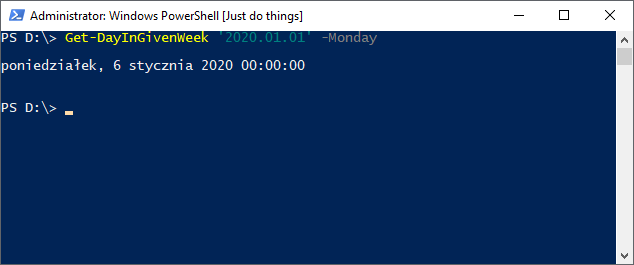
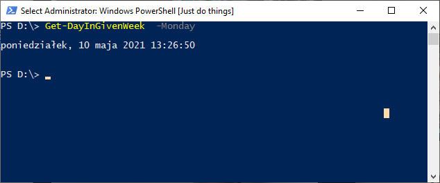

<!--Category:PowerShell--> 
 <p align="right">
    <a href="https://www.powershellgallery.com/packages/ProductivityTools.GetDayInGivenWeek/"></a>
    <a href="http://www.productivitytools.tech/get-day-in-given-week/"><a> 
    <a href="https://github.com/pwujczyk/ProductivityTools.ConvertDocuments/"></a>
</p>
<p align="center">
    <a href="http://http://productivitytools.tech/">
        
    </a>
</p>

# Get day in given week

Module calculates date of day of week (Monday, Tuesday,…) for given week.

Lets say that I would like to receive first Monday after 2018.01.01 I could use command

```powershell
Get-DayInGivenWeek '2020.01.01' -Monday
```
and it will return

```powershell
2020.01.06
```



If I would like to find previous one then I will use

```powershell
Get-DayInGivenWeek '2020.01.01' -Monday -Before
2019.12.30
```

Day parameter can be ommited. Than current date will be taken.


